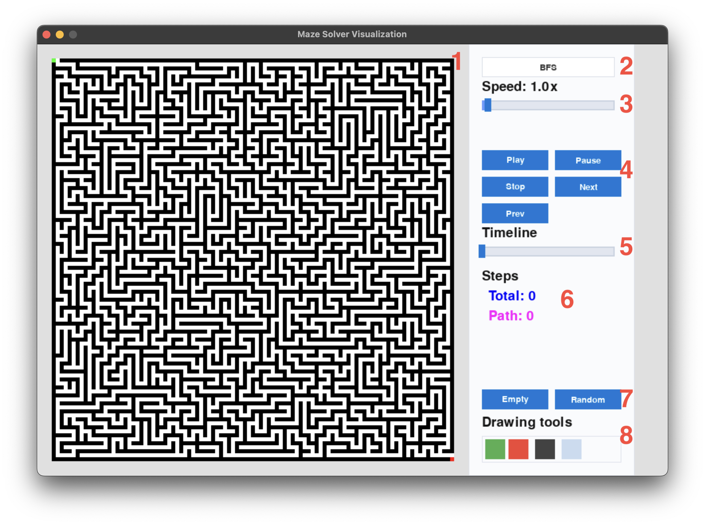

# A*MAZEing

A*MAZEing is a simple maze pathfinding algorithm visualizer built with Python and Pygame. It allows users to create mazes and visualize the A* , Dijkstra, BFS, and DFS algorithms in action.

## Installation

1. Clone the repository:
   ```bash
    git clone https://github.com/eeroleppalehto/pathfinder.git
    ```
2. Navigate to the project directory:
```bash
    cd pathfinder
```
4. Install the required dependencies:
```bash
    pip install -r requirements.txt
```


## Usage

You can run the program by executing the following command in your terminal:

```bash
python run-application.py
```



1. The maze canvas where black squares are walls and white squares are free spaces. The green square is the starting point, and the red square is the ending point. Once the pathfinding algorithm is started, the visited cells will be colored blue, and the path will be colored magenta.
2. Dropdown menu of the pathfinding algorithms. The available algorithms are:
   - A* (A-star)
   - Dijkstra
   - BFS (Breadth-First Search)
   - DFS (Depth-First Search)
3. Slider to adjust the speed of the algorithm.
4. Buttons for controlling the playback of the algorithm.
5. Timeline slider of the pathfinding algorithm. You can drag the slider to go back and forth in the timeline of the algorithm. The timeline is only available when the algorithm is running.
6. View of how many cells are visited and what is the length of the found path.
7. Buttons to clear the maze and to generate a new maze.
8. Selection of draw mode. You can choose between:
   - Draw start point (green square)
   - Draw end point (red square)
   - Draw walls (black squares)
   - Erase walls (white squares)
